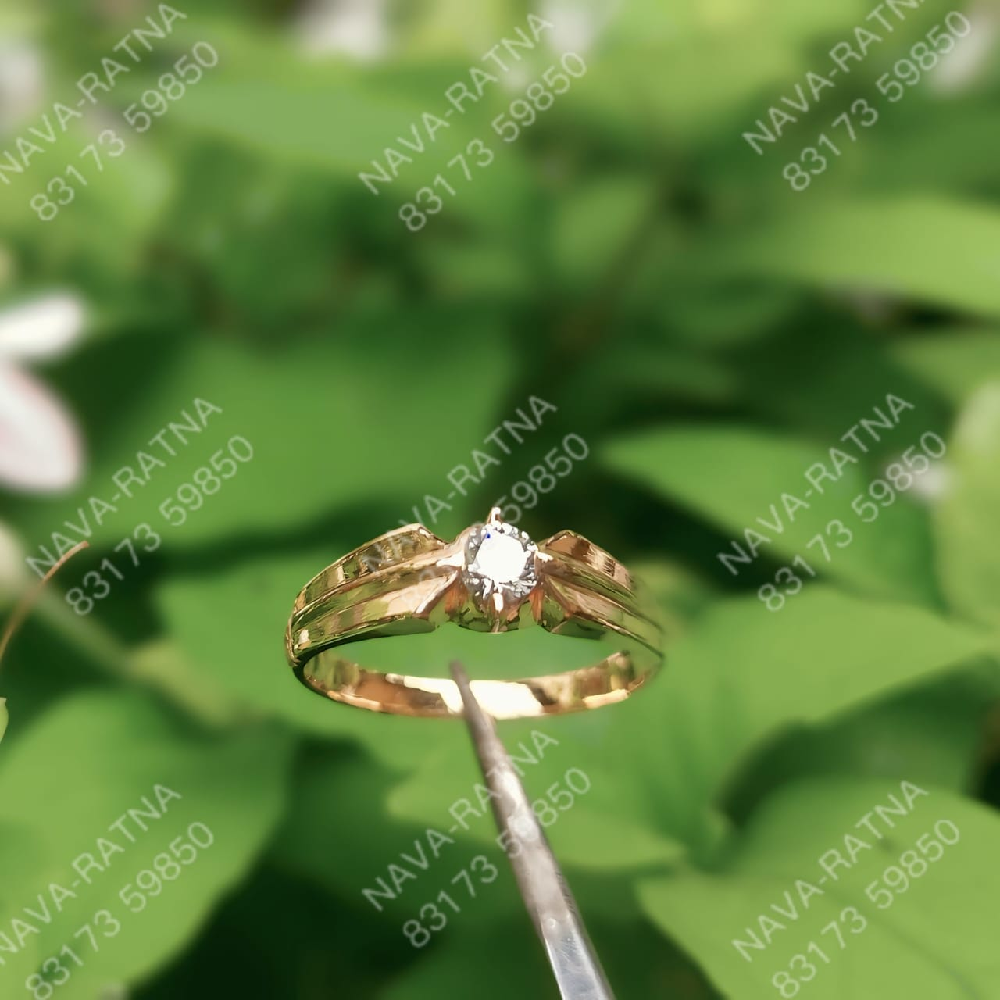
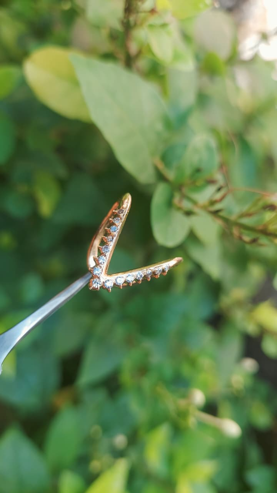
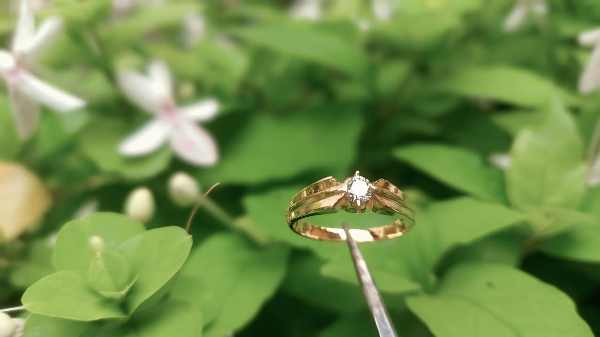
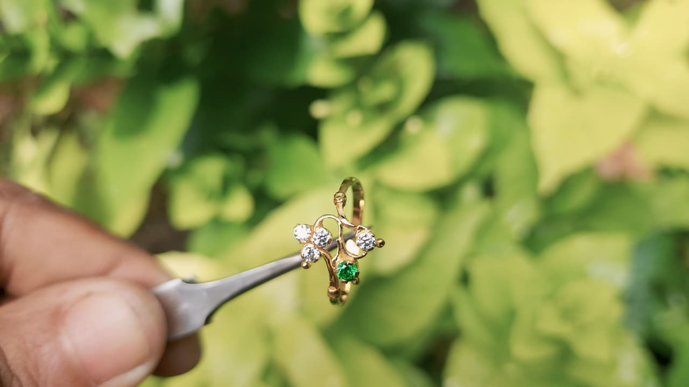
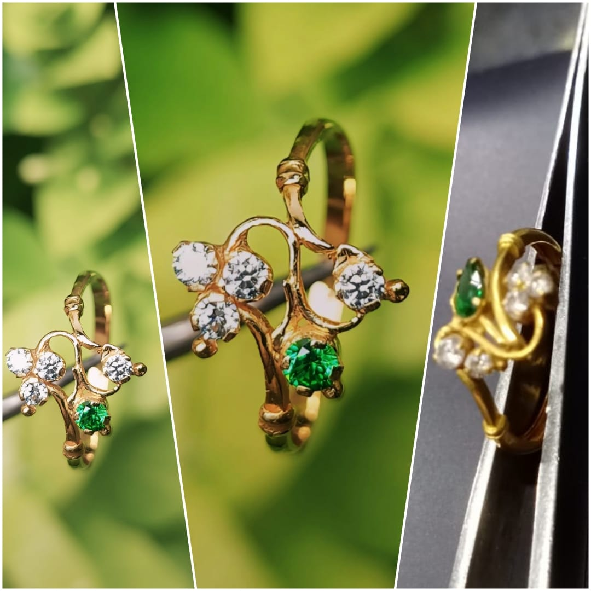

<!DOCTYPE html>
<html lang="en">
<head>
<meta charset="UTF-8" />
<meta name="viewport" content="width=device-width, initial-scale=1.0" />
<title>Nava-Ratna</title>

</head>
<body>
<header>
    
Nava-Ratna

</header>

    

        
        
        
        
        
    

<h2 style="text-align:center; margin-top:30px;">Our Premium Gold Ring Collection</h2>

<!-- Products grid (generated) -->

<!-- Product detail page (opens when clicking a product) -->

    <button id="backBtn" style="padding:10px 15px; margin-bottom:15px;">← Back</button>
    
    <h2 id="detailTitle" style="margin-top:15px;">Nava-Ratna</h2>
    

<a href="tel:+918317359650" class="orderButton" id="orderBtn">Call to Order</a>

<footer>© 2025 Nava-Ratna — Premium Handcrafted Gold Rings</footer>

</body>
</html>
